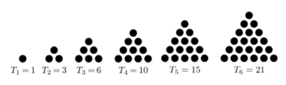
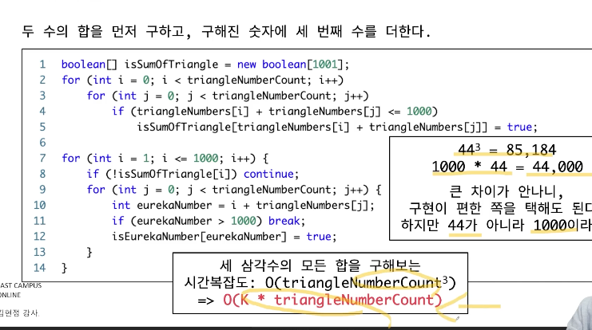

- 유형 : 브루트 포스
- 유레카 이론

##### 문제 분석 
1. 삼각수 : 기하학적으로 일정한 모양의 규칙을 갖는 점들의 모음

2. 각 삼각수 Tn = 1 + 2 + 3 + ... + n = n(n + 1)/2
3. 문제 조건 -> 정수가 3개의 삼각수의 합으로 표현될 수 있는가?
- 단, 3개의 삼각수가 모두 달라야 할 필요는 없음.

##### 풀이
1. 자연수 K가 최대 1000이다. 
- 즉, 1000 이상의 삼각수는 체크할 필요가 없다.
- 미리 1000보다 작거나 같은 삼각수에 대해 미리 배열에 저장해두고 완전 탐색으로 찾는다.
- 찾는 순간 true, 못 찾으면 false이다.

2. 완전 탐색을 사용할거면 시간 복잡도에 대해 생각해봐야 한다.
- T50 = 50(50 + 1) / 2 = 25 X 51 > 1000
- 50번째 삼각수가 1000보다 크기 때문에, 50개의 삼각수를 미리 구해둔다고 가정할 때
- 서로 다른 50개 중 중복을 허용해서 3개를 선택하는 조합은
- 50H3 = 52C3 < 100만이므로 하나당 100만 이하로 연산이 가능하다.

3. 사전 계산 : 테스트 케이스마다 삼각수를 구하지 않고, 시작시 미리 저장해서 반복을 줄임.
4. 정렬된 데이터라면, break를 쓰는 게 성능의 향상을 가져올 수 있음.

- 삼각수의 개수를 줄이는 것이 가장 중요하다.

- 두 수의 합을 먼저 구하고, 구해진 숫자에 세 번째 숫자를 더하는 풀이도 가능.
- 입력의 개수가 커진다면, 고려해볼만한 풀이.