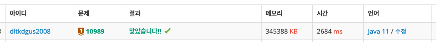
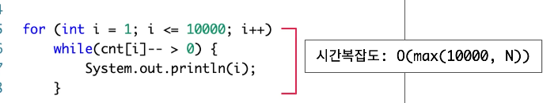

- 유형 : 배열
- 수 정렬하기 3

##### 문제 분석
1. N개의 수가 최대 1천만개가 주어질 수 있음 ( 시간 초과 주의 )
2. N개의 줄의 수는 10000보다 작거나 같은 자연수 ( 수의 범위가 정해짐 )
3. 오름차순 정렬한 결과를 한 줄에 하나씩 나타내야 함.

##### 풀이
1. O(N^2)시 시간 초과.
2. O(N logN) 정렬 사용 시 -> 1000만 x log2 1000만 ( 정렬 시 이진 로그)
3. 시간 내에 통과는 할 수 있어도, 효율성이 떨어짐. Arrays.sort 사용 시 2.6초 가량 소요.

4. 수의 범위가 정해져있으니, 1~10000의 등장 빈도를 체크해서 출력만 순서대로 해주면 됨.

##### 포인트
1. 삽입 정렬의 시간 복잡도 : O(N^2)
2. Arrays.sort()의 시간 복잡도 : 최악의 경우 O(N^2)의 여지가 있음.

- 중첩 반복문처럼 보이지만 안쪽 루프의 수행은 입력 크기 N에 묶여 있다.
- 결국, cnt[i]의 모든 합이 N이기 때문에 내부 print의 수행횟수는 O(N)이 된다.
- 전체 시간복잡도는 두 과정의 합인 O(10000 + N)이 되는데, 더 큰 값에 지배받기 때문에
- O(max(10000, N))으로 표현하는 것이다.
3. 입출력 속도 비교 ( 결론, BufferedReader, BufferedWriter를 쓰자. )
- https://www.acmicpc.net/blog/view/56
- https://www.acmicpc.net/blog/view/57
